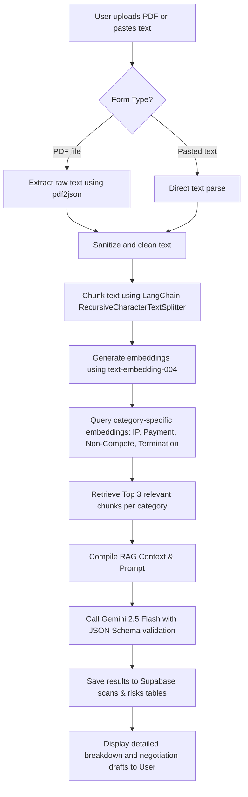

# TermShield 🛡️

**Intelligent AI-Powered Contract Protection for India's Freelancers & Agencies**

TermShield scans client contracts for predatory terms and risk patterns that silently cost Indian freelancers lakhs of rupees. In under 60 seconds, it provides plain-English risk detection, financial impact scoring, and one-click draft responses to help negotiate better contracts.

---

## 🚀 The Problem & The Solution

### The Problem
Most freelancers and small agencies in India lose money not because of a lack of skill, but because they sign terms they cannot fulfill or that work against them. Contracts often contain:
- **Delayed Payments (Net-90 or Net-120 terms)** that squeeze cashflow.
- **Predatory IP Ownership** where rights transfer before payment is fully cleared.
- **Vague Termination Clauses** allowing clients to walk away without paying for work done.
- **Restrictive Non-Competes** that block freelancers from working in their own industry.

### The Solution
TermShield serves as the first line of defense. By parsing uploaded PDF contracts and feeding them through a semantic RAG (Retrieval-Augmented Generation) pipeline, TermShield analyzes critical legal clauses in seconds. It empowers freelancers with:
- **Visual Risk Classification** (Critical, Important, Safe).
- **Financial Loss Estimations** in INR.
- **1-Click Professional Negotiation Drafts** to copy-paste directly to the client.
- **Instant Sharing** to WhatsApp and email.

---

## 🛠️ The Tech Stack

TermShield is built on a modern, high-performance, and secure serverless architecture:

- **Frontend & Routing**: [Next.js 14](https://nextjs.org/) (using React 18, App Router, TypeScript).
- **Styling**: [Tailwind CSS](https://tailwindcss.com/) combined with bespoke CSS for ambient animations, glassmorphism, and premium mesh gradients.
- **AI Core**:
  - **Large Language Model**: Google Gemini API via `@google/genai` (specifically using the state-of-the-art **`gemini-2.5-flash`** model).
  - **Embeddings & Document Chunking**: [LangChain](https://js.langchain.com/) (`@langchain/textsplitters` for chunking and `@langchain/google-genai` for **`text-embedding-004`** embeddings).
- **PDF Extraction**: `pdf2json` (configured as an external server component package to ensure optimal performance in serverless runtimes).
- **Database & Auth**: [Supabase](https://supabase.com/) (`@supabase/supabase-js` client) for user registration, scan logs, and risk storage.
- **Schema Validation**: [Zod](https://zod.dev/) for robust, type-safe API requests and response validation.
- **Integrations**:
  - **Payments**: Razorpay (for scan credits/subscription logic).
  - **Emails**: Resend (for forwarding reports and notifications).

---

## ⚙️ How It Works (The Pipeline)

When a contract is uploaded, TermShield processes it through the following pipeline:



1. **Text Extraction & Sanitization**: PDF binaries are parsed stream-by-stream using `pdf2json`, sanitizing control characters to prevent breaks in JSON serialization.
2. **Recursive Chunking**: The contract text is broken down into overlapping chunks (size `800`, overlap `100`) to preserve context.
3. **Semantic Querying**: Using cosine similarity between the chunk embeddings and four legal query vectors (covering IP, Payments, Exclusivity, and Termination), the pipeline targets the exact location of potential risks.
4. **Structured JSON Generation**: The retrieved context is formatted into a prompt demanding exactly four categorized evaluations. Gemini returns this in a schema enforced by Zod.

---

## 📂 Project Structure

```
├── app/
│   ├── api/
│   │   ├── auth/            # Auth webhooks and user management
│   │   ├── cron/            # Scheduled tasks (cleanups, retries, digests)
│   │   ├── payment/         # Razorpay checkout and verification webhooks
│   │   └── scan/            # PDF upload, text parsing, and processing pipeline
│   ├── login/               # Sign-in UI
│   ├── signup/              # Registration UI
│   ├── settings/            # User account settings & usage history
│   ├── scan/[id]/           # Detailed scan results dashboard
│   ├── globals.css          # Main stylesheet & custom utility styles
│   └── page.tsx             # Landing page with interactive sections
├── components/              # Shared components (UploadForm, Nav, etc.)
├── contexts/                # React Contexts (AuthContext for user state)
├── lib/
│   ├── llm.ts               # Gemini integration & LangChain RAG pipeline
│   ├── pdf.ts               # PDF parser and sanitization wrapper
│   ├── pipeline.ts          # Core logic orchestrating RAG + LLM execution
│   ├── scans.ts             # Supabase abstraction layer for scan records
│   └── supabase.ts          # Supabase client instantiation
└── types/                   # Shared TypeScript interface definitions
```

---

## 🔧 Installation & Setup

### Prerequisites
- Node.js (v18+)
- A Supabase project
- A Google AI Studio API key (for Gemini)

### 1. Clone & Install Dependencies
```bash
git clone https://github.com/LeonDae/termshield.git
cd termshield
npm install
```

### 2. Environment Configuration
Create a `.env.local` file in the root directory and fill in your credentials:
```env
# Supabase Configuration
NEXT_PUBLIC_SUPABASE_URL=https://your-project-id.supabase.co
NEXT_PUBLIC_SUPABASE_ANON_KEY=your-supabase-anon-key
SUPABASE_SERVICE_ROLE_KEY=your-supabase-service-role-key

# Google Gemini API
GEMINI_API_KEY=your-gemini-api-key

# Resend Email Configuration (Optional)
RESEND_API_KEY=your-resend-key

# Razorpay Configuration (Optional)
RAZORPAY_KEY_ID=your-razorpay-key-id
RAZORPAY_KEY_SECRET=your-razorpay-secret

# Application URL
NEXT_PUBLIC_APP_URL=http://localhost:3000
```

### 3. Run Development Server
```bash
npm run dev
```
Open [http://localhost:3000](http://localhost:3000) to see the application.

---

## ☁️ Deployment

### Vercel Deployment
To deploy this application to Vercel, ensure you configure the **Environment Variables** in the Vercel dashboard:
1. Go to your project page in Vercel → **Settings** → **Environment Variables**.
2. Add all variables listed in your `.env.local` file.
3. Next.js will automatically configure the external server components using `pdf2json`.

---

## 🔮 Roadmap
- **Rate Calculators**: Helping freelancers determine minimum fees based on contract risk levels.
- **AI Proposal/SOW Builder**: Write contract templates pre-optimized to pass TermShield criteria.
- **WhatsApp Overdue Alerts**: Pinging clients politely on behalf of the freelancer when milestones pass unpaid.
- **Light Escrow Integration**: Holding payments securely before transferring intellectual property.
